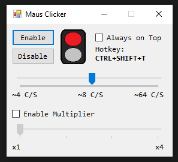

# AutoClicker

AutoClicker is a simple .EXE created by myself, with the help of others.  
Inspiried by some old, other `MichisClicker` i wanted to do my own, so here we go:

> I want to thank all of you, helping, advising and supporting me. Especially:
>
> - All People, who already asked similar questions in online sites, like Stackoverflow :L

### Table of Contents

[**Setup**](#setup)  
[**How to use**](#how-to-use)  
[**Changelog**](#Changelog) 

## Setup

Download the VS Solution and Compile the exe for yourself,
or find it in the release folder.

`\bin\Release\AutoClicker.exe`  

## How to use

I dont think i need to explain this, or?  

Enable / Disable button will enable / disable it.  
The hotkey `CTRL+SHIFT+T` will toggle the Clicker.  
With `Always on Top` you can force the Clicker to be on top on other Windows.  
I added a selfmade traffic light like indicator, to tell, if the Clicker is on or off.

For some serious fast clicking needs, you can enable the Muliplier and slide it to x4.  
With some math you can calculate how many clicks you could do with this.

## Changelog

### 2022-01-19 V.1.0.2

- Added Multiplier
- Renamed from `MausClicker` to `AutoClicker`
- Bugfix, starting C/S not right
- Added README.md
- Other Github stuff

### 2022-01-19 V.1.0.0

- First Release
